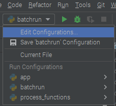
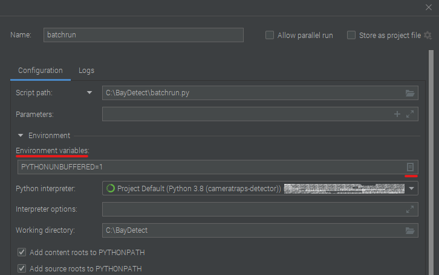

# BayDetect

BayDetect is a stack of functions aims to help streamline the pre- and post-processing of camera trap images via Microsoft's
[MegaDetector](https://github.com/Microsoft/CameraTraps#megadetector).
This project was developed within the 
[Biodiversity, Conservation and Wildlife Management Department @ Bavarian State Institute of Forestry](https://www.lwf.bayern.de/en/221946/index.php). 

## What does this project hope to achieve?
 
1. Partially removing the costly and intensive manual labor process of classifying images containing animals vs those without.

2. Reducing the repetitive steps encountered when using [MegaDetector batch processing](https://github.com/microsoft/CameraTraps/blob/master/megadetector.md#2-run_tf_detector_batchpy)
for large datasets.

## Why BayDetect?

The project was created help scientists from the Wildlife Monitoring and Management Team at LWF to detect different 
animal species in forests in and around Bavaria, Germany. Hence, the name `BayDetect` was chosen.

## **Important notes**

*At the moment, BayDetect is only supported for Linux and Windows OS. Thus, if you using it on a MAC, please keep in 
mind that there you might encounter potential MAC-related errors/problems.*

There are two ways to use BayDetect:
- Via a Graphical User Interface (GUI) with was built using `tkinter` library from Python
- Via the command line, for which users can give BayDetect instructions using the built-in 
[`input()` functions from Python](https://docs.python.org/3/library/functions.html#input).

The three main modules needed for running MegaDetector are Microsoft's [CameraTraps](https://github.com/microsoft/CameraTraps), [ai4eutils](https://github.com/microsoft/ai4eutils), as well as [yolov5](https://github.com/ecologize/yolov5/)
are added to BayDetect as `git submodules`, which allows users to track the most update-to-date version of these three repositories.

The [MegaDetector's model](https://github.com/microsoft/CameraTraps/blob/master/megadetector.md#downloading-the-model)
exceeds GitHub's file size limit of 100.00 MB. Thus, please download it to your computer before running.

## Prerequisites / Installation guide

### 1. Clone the repo *recursively*

    git clone --recursive https://github.com/enguy-hub/BayDetect.git

### 2. Fetch new updates for `cameratraps`, `ai4eutils`, and `yolov5` submodules

- For ai4eutils, "cd" into `/ai4eutils` directory and run the following commands:

      git checkout master
      git pull

- For cameratraps, "cd" into `/cameratraps` directory and run the following commands:

      git checkout main
      git pull

- For yolov5, "cd" into `/yolov5` directory and run the following command:

      git checkout main
      git pull

### 3. Set `PYTHONPATH` for the three `cameratraps`, `ai4eutils`, and `yolov5` submodules. Example below assumpts that BayDetect was installed and saved directly on "C:" drive

- For WINDOWS, following this [Windows' instruction](https://github.com/microsoft/CameraTraps/blob/main/megadetector.md#windows-instructions-for-gitpython-stuff). For example:

      set PYTHONPATH=%PYTHONPATH%;c:\baydetect\cameratraps;c:\baydetect\ai4eutils;c:\baydetect\yolov5

- For LINUX, following this [Linux's instruction](https://github.com/microsoft/CameraTraps/blob/main/megadetector.md#linux-instructions-for-gitpython-stuff). For example:

      export PYTHONPATH="$PYTHONPATH:$HOME/baydetect/cameratraps:$HOME/baydetect/ai4eutils:$HOME/baydetect/yolov5"

- For MAC, following this [Mac's instruction](https://github.com/microsoft/CameraTraps/blob/main/megadetector.md#mac-instructions-for-gitpython-stuff). For example:

      export PYTHONPATH="$PYTHONPATH:$HOME/baydetect/cameratraps:$HOME/baydetect/ai4eutils:$HOME/baydetect/yolov5"

### 3a. Set `PYTHONPATH` for PyCharm users (also work for work-station with restrictive admin privileged)

- Open `BayDetect` project in PyCharm

- Click `Edit Configuration` after clicking on the `Select Run/Debug Configuration` dropdown bar

  

- Add a new python script by clicking the `+` icon on the top left-corner. Then define the `Script path`, `Python interpreter`, and `Working directory` accordingly

  

- Under `Environment variables` click on the little notebook icon on the right of the box

  

- Click on the `+` sign and add the `PYTHONPATH` variable with the absolute paths to the three submodules inside where you stored the `BayDetect` folder 

   

### 4. Download MegaDetector `md_v5a.0.0.pt` and/or `md_v5b.0.0` model files and save it in the `/cameratraps/detection/` folder

- The easiest way is to download it directly from the link shown in the [CameraTraps's GitHub page](https://github.com/microsoft/CameraTraps/blob/main/megadetector.md#megadetector-v50-20220615)

- **VERY IMPORTANT**: Once you have downloaded the model file, please save the model files `md_v5a.0.0.pt` and 
`md_v5b.0.0` in the `cameratraps/detection` folder.

### 5. Download and Install Miniconda

- Go to [Miniconda page](https://docs.conda.io/en/latest/miniconda.html) and follow the instruction on how to download and install Miniconda based on your own OS.

### 6. Create `cameratraps-detector` conda environment by running this command at root folder (`/BayDetect`):

    conda env create --file env.yml

### 7. Activate `cameratraps-detector` conda environment

    conda activate baydetectenv

### 8. Putting the images that you want to be classified inside `/image_data` directory

***Our example***: 
- Navigate to `/example/image_data/Example_Forest/` folder to see how the IMAGE FILES are currently being 
stored on our server at LWF.

### 9. Create sub-folders inside the `/metadata` directory for the output JSON, CSV and TXT files, which will be created after running `BayDetect`

***Our example***: 
- Navigate to `/example/metadata/Example_Forest/` folder to see how the OUTPUT JSON,CSV, and TXT FILES are currently 
being stored on our server at LWF.

### !!! Once all the above steps are complete, you are ready to use BayDetect !!!

## Extra - Detection confidence threshold

Optional: if you want MegaDetector to only save detection boxes with detection confidence of 80% or above in the output 
JSON file, open the `cameratraps/detection/run_detector.py` file and change the value on `line 101 & 102` to 
`0.25 and 0.20` if you are using MDv5a and the same on `line 101 & 102` for MDv5b as follows:

    'typical_detection_threshold':0.25,
    'conservative_detection_threshold':0.20},

## Features in BayDetect

#### Processing Functions (PF)
- 1/ Create the `BatchInput` JSON file needed to execute `MegaDetector` via `run_detector_batch.py` script.
- 2/ Run MegaDetector via `run_detector_batch.py` script using the `BatchInput` JSON file as input, 
and produce a `MegaDetected` JSON file as the output.
- 3/ Convert the output `MegaDetected` JSON file into an organized CSV `Metadata` file.
- 4/ Sort the images into separated folders based on their `MegaDetected` classes indicated in the CSV `Metadata` file.

#### Batch Functions (BF)
- 1/ Create '.txt' files containing the commands needed to 'batch-run' one of the Processing Function (except for 
Processing Function #2 | Run MegaDetector)
- 2/ Create a combined ".txt" file containing the commands needed to start the `pf_batchrun()` from `batchrun.py`.
- 3/ Create ".txt" file containing the commands needed to 'batch-run' the process of executing MegaDetector via the 
`md_batchrun()` from `batchrun.py`. ('batch-run` function for Processing Function #2 | Run MegaDetector)

#### Utility Functions (UF)
- 1/ Find and replace the names of multiple folders at once.
- 2/ Find and replace the names of multiple files at once.
- 3/ Find and replace the text-content inside multiple files at once.

## How to run BayDetect

- 1/ Run `app.py` script at root folder (`/BayDetect`) via the command below:

      python app.py

- 2/ Choose the function that you would like to like use

- 3/ Follow the prompted steps and instruction to execute the desired function

## Suggestions & notes for when executing the functions

### Processing Function (PF)

#### PF 1 | Create the `BatchInput` JSON file

- We suggest the `BatchInput (BI)` JSON file should be saved in a `*_BatchInput/` folder, 
and the filename should end it with `*_BI.json`, similar to the example below:

      /BayDetect/example/metadata/Example_Forest/EF_JSON/EF_BatchInput/*_BI.json

- Additionally, when working with a large dataset which has many stations and sessions, we suggest that each JSON file 
should be named corresponding to its station and session. See the example JSON files in the directory stated below:

      /BayDetect/example/metadata/Example_Forest/EF_JSON/EF_BatchInput/EF_001_20201104_BI.json

#### PF 2 | Run MegaDetector 

- We suggest that the output `MegaDetected (MD)` JSON files should be saved in a `*_MegaDetected/` folder, and the 
filenames to end with `*_MD.json` similar to our example below:

      /BayDetect/example/metadata/Example_Forest/EF_JSON/EF_MegaDetected/EF_001_20201104_MD.json

#### PF 3 | Convert output `MegaDetected (MD)` JSON file into an organized CSV `Metadata (Meta)` file.

- We suggest that the output CSV `Metadata (Meta)` files should be saved in a `*_CSV/` folder, and the filename to 
end with `*_Meta.csv`, similar to the example below:

      /BayDetect/example/metadata/Example_Forest/EF_CSV/*_Meta.csv

- Additionally, when working with a large dataset that has many stations and sessions, we suggest that each CSV file 
should be named corresponding to its station and session. See the example files in the directory stated below:

      /BayDetect/example/metadata/Example_Forest/EF_CSV/EF_001_20201104_Meta.csv

#### PF 4 | Sort images into folders based on their `MegaDetected` classes indicated in the CSV `Meta` file

- When `Y` is selected for `*_Sorted` folder, copies of the original images will be sorted in `Animal`, `Human`, 
`Vehicle`, `Empty`, or `Assitant Required` sub-folders inside a folder called `*_Sorted` located on the same level 
as the folder where the images are stored in. 

- When `N` is selected for `*_Sorted` folder, the original images will be moved to `Animal`, `Human`, `Vehicle`, `Empty`
, or `Assitant Required` sub-folders inside the original folder where the images are stored in. 

***`Assistant Required`: when detected objects belong to two or more classes in a single image***

### Batch Function (BF)

#### BF 1 | Create `.txt` files needed to 'batch-run' one of the Processing Functions (except for `Run MegaDetector`)

- For better organizing the output `.txt` files, we suggest to store the files similar to our folder structure 
as shown in the `EF_batch_commands/` example folder. For reference, please check out the folder structure and how the 
`.txt` files are saved in the `EF_batch_commands/` example folder. Path to `EF_batch_commands/` folder is listed below:

      /example/metadata/Example_Forest/EF_batch_commands/

#### BF 2 | How to execute `pf_batchrun()` function from `/batchrun.py` script

- 1/ Copy the commands (the text-content) from the newly created `*pf<1, 2, or 3>*_combinedCmds.txt` file 
into the `pf_batchrun()` function in the `batchrun.py` script, and make sure that they are below line `6`

- 2/ Run `batchrun.py` script via the command below:
    
      python batchrun.py
    
- 3/ Enter number `1` to execute the function

**Note**: If you have a large dataset with many stations and sessions, you will receive an 
"error" saying that your commands are too long. When this happens, just commented out a portion 
of the commands and execute them in multiple smaller executions.

#### BF 3 | How to execute `md_batchrun()` function from `/batchrun.py` script

- 1/ Copy the commands (the text-content) from the newly created `pf2_runMD_cmds` into the 
`md_batchrun()` function in the `batchrun.py` script, and make sure that they are below line `18` 

- 2/ Run `batchrun.py` script via the command below:
    
      python batchrun.py
    
- 3/ Enter number `2` to execute the `md_batchrun()` function

**Note**: If you have a large dataset with many stations and sessions, you will receive an "error" saying that your 
commands are too long. When this happens, just commented out a portion of the commands and execute them in multiple
smaller executions.

# License
Distributed under the MIT License. See `LICENSE.txt` for more information.
